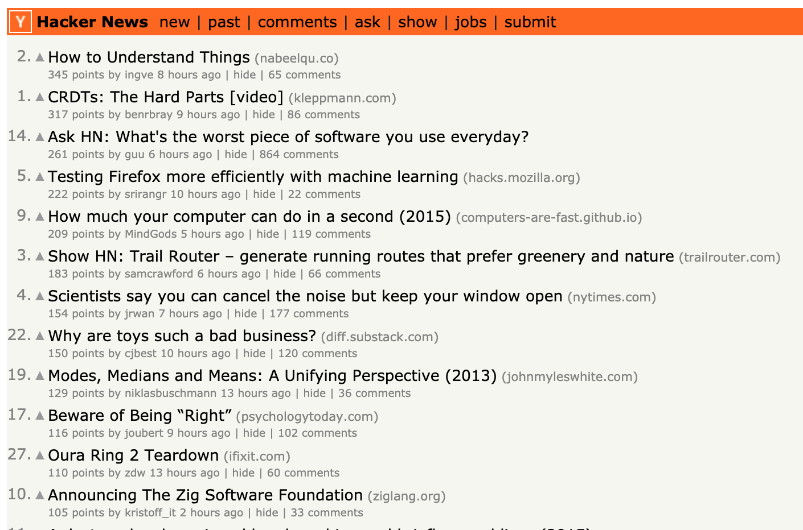

# HackerNews Sorted

Chrome Extension that sorts the HackerNews homepage by score

# Installation

### This extension is not currently available in the Chrome Extension store.

#### To install follow the steps below:

1. Clone or download the project from GitHub
2. Open Google Chrome and navigate to [chrome://extensions/](chrome://extensions/)
3. Check the "Developer Mode" checkbox
4. Click Load Unpacked Extension button
5. Select the hackernews-sorted directory that you downloaded in step 1
